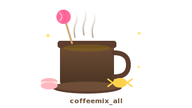

# coffeemix_all

<div align="center">



**언어:** [English](./README.md) | 한국어

</div>

---

OpenCode + OMO를 위한 전문화 에이전트 시스템 — 워크플로우, 라우팅, 검증이 계층화된 workspace입니다.

## 필수 요구사항

coffeemix_all을 사용하려면 다음 두 프로그램이 시스템에 설치되어 있어야 합니다:

| 프로그램 | 설명 | 설치 방법 |
|---------|------|---------|
| [OpenCode](https://github.com/opencode-ai/opencode) | 터미널 기반 AI 코딩 에이전트 | `npm install -g opencode-ai` |
| [oh-my-openagent](https://github.com/code-yeongyu/oh-my-openagent) | OpenCode 플러그인 — 다중 에이전트 오케스트레이션 | `npm install -g oh-my-opencode` |

두 프로그램 설치 후 `bunx oh-my-opencode install`을 실행하여 모델 provider를 설정하세요.

## 빠른 시작

```powershell
# 패키지를 클론 또는 다운로드한 후:
cd coffeemix_all_0_1
.\install-global.ps1
```

자세한 설치 방법은 [`docs/installation-guide.md`](./docs/installation-guide.md)를 참조하세요.

## coffeemix_all이란?

coffeemix_all은 다음을 제공합니다:

- **14개 `gb-*` 전문 에이전트** — 리뷰, 디버깅, 계획, 진단, 상태 확인, 인수인계 등 특화된 작업을 담당하는 에이전트
- **8개 로컬 스킬** — 계획, 디버깅, 검증, 도입 심사를 위한 재사용 가능한 워크플로우 게이트
- **검증 하니스** — 작업 행동과 전문 에이전트 라우팅을 시나리오 기반으로 테스트
- **전역 설치 스크립트** — 기존 OMO 설정에서 모델을 자동으로 매핑하는 PowerShell 설치 도구

## 구조

| 경로 | 용도 |
|------|------|
| `.opencode/agents/` | 14개 `gb-*` 전문 에이전트 프롬프트 |
| `.opencode/skills/` | 8개 로컬 워크플로우 스킬 |
| `.opencode/plugins/` | UI 배지 플러그인 |
| `scenarios/` | 작업 기반 행동 시나리오 |
| `routing-scenarios/` | ID-프롬프트 라우팅 검증 (28개 시나리오 × 14개 에이전트) |
| `tools/` | 검증 하니스 및 러너 |
| `docs/` | 설치 가이드 및 아키텍처 문서 |

## 스킬

| 스킬 | 용도 |
|------|------|
| `ask-user-question` | 되돌릴 수 없는 작업 전에 명시적 사용자 확인 요구 |
| `compact-context` | 긴 세션의 핵심 정보를 유지하며 요약 |
| `enter-plan-mode` | 중요 구현 전 계획 모드로 전환 |
| `integration-intake` | 외부 워크플로우/도구 도입 심사 게이트 |
| `systematic-debugging` | 증상 추측이 아닌 근본 원인 기반 디버깅 |
| `test-driven-development` | 변경 전 실패하는 테스트 또는 수용 기준 정의 |
| `tool-search` | 작업 맥락에 맞는 도구 자동 발견 및 선택 |
| `verification-before-completion` | 완료 선언 전 신선한 증거 요구 |

## 검증

검증 하니스를 실행하여 전문 에이전트 라우팅과 시나리오 동작을 확인하세요:

```bash
# 스모크 체크 (파일 존재, 인벤토리, 일부 시나리오)
python tools/workspace_smoke_runner.py

# 전체 e2e 검증 (모든 시나리오, 엄격한 검사)
python tools/workspace_e2e_runner.py

# 라우팅 검증 (28개 ID-프롬프트 시나리오 × 14개 전문 에이전트)
python tools/routing_validation_runner.py
```

리포트는 `reports/`에 저장됩니다 (gitignore 처리됨).

## 전문 에이전트 목록

| 에이전트 | 역할 |
|---------|------|
| `gb-commit` | git 커밋 워크플로우 — Conventional Commits, 원자적 커밋 |
| `gb-review` | 코드 리뷰 — 정확성, 보안, 아키텍처, 유지보수성 |
| `gb-debug` | 버그 조사 — 근본 원인 추적, 증거 기반 디버깅 |
| `gb-ultraplan` | 심층 아키텍처 계획 — 대규모 리팩토링, 시스템 설계 |
| `gb-doctor` | 시스템 진단 — 프로젝트 건강 상태, 설정 문제 진단 |
| `gb-compact` | 컨텍스트 압축 — 긴 세션 요약, 핵심 정보 보존 |
| `gb-resume` | 세션 재개 — 중단된 작업 분석, 계속 계획 수립 |
| `gb-share` | 세션 내보내기 — 인수인계용 요약 생성 |
| `gb-statusline` | 상태 표시 — 활성 설정, 작업 컨텍스트 개요 |
| `gb-teleport` | 컨텍스트 전환 — 브랜치, worktree, 세션 간 안전한 이동 |
| `gb-worktree` | git worktree 관리 — 병렬 브랜치 작업 |
| `gb-config` | 설정 검사 — 설정 충돌, 위험 설정 식별 |
| `gb-memory` | 세션 메모리 — 세션 간 지속되어야 할 컨텍스트 추출 |
| `gb-plugin` | 플러그인 관리 — 발견, 평가, 설치, 충돌 진단 |

## 감사의 말

이 프로젝트는 AI 에이전트 생태계의 다른 작업물들을 기반으로 합니다:

- **[OpenCode](https://github.com/opencode-ai/opencode)** — 이 전체 워크스페이스를 구동하는 터미널 기반 AI 코딩 에이전트 런타임입니다. OpenCode는 실행 셸, 도구 시스템, 플러그인 아키텍처를 제공하여 coffeemix_all의 에이전트와 스킬이 실행될 수 있게 합니다. OpenCode의 개방적이고 확장 가능한 설계가 없었다면 이 계층화된 전문 에이전트 시스템은 존재할 수 없었습니다.
- **[oh-my-openagent](https://github.com/code-yeongyu/oh-my-openagent)** — OpenCode와 coffeemix_all 사이에 위치하는 다중 에이전트 오케스트레이션 플러그인입니다. 모델 라우팅, 폴백 체인, 에이전트 레지스트리, 카테고리 시스템을 제공하여 gb-* 전문 에이전트가 자동으로 선택·배치될 수 있게 합니다. 또한 `install` 커맨드는 전역 설치 스크립트의 자동 모델 매핑 기능의 참조 모델이 되었습니다.
- **[obra/superpowers](https://github.com/obra/superpowers)** — 8개 로컬 디서플린 스킬(`ask-user-question`, `compact-context`, `enter-plan-mode`, `systematic-debugging`, `test-driven-development`, `tool-search`, `verification-before-completion`, `integration-intake`)은 이 프로젝트의 스킬 패턴과 워크플로우 게이트 개념에서 차용했습니다.
- **[garrytan/gstack](https://github.com/garrytan/gstack)** — 다중 에이전트 라우팅 아키텍처와 전문 에이전트 계층화 개념(작업이 일치할 때 일반 에이전트보다 좁은 범위의 전문 에이전트를 우선)은 이 프로젝트의 에이전트 오케스트레이션 패턴에서 영감을 받았습니다.

## 구성 요소 출처

| 접두사 / 소스 | 출처 |
|---------------|------|
| `gb-*` 전문 에이전트 | coffeemix_all 오리지널 ("gb" = 가베, 한국어 'coffee'의 옛말) |
| 로컬 디서플린 스킬 | [obra/superpowers](https://github.com/obra/superpowers)에서 차용 |
| `integration-intake` | Claude 기반 통합을 위한 coffeemix_all 로컬 도입 심사 |
| 기본 에이전트 (`sisyphus`, `oracle`, `librarian` 등) | [oh-my-openagent](https://github.com/code-yeongyu/oh-my-openagent) 제공 |
| 커맨드 및 워크플로우 영감 | [Claude Code](https://github.com/anthropics/claude-code) by Anthropic |

이 저장소의 모든 전문 에이전트 프롬프트, 로컬 스킬, 검증 스크립트, 라우팅 시나리오는 독립적으로 작성된 workspace 로컬 산출물입니다.

## 라이선스

이 프로젝트는 MIT 라이선스를 따릅니다 — 자세한 내용은 [LICENSE](./LICENSE) 파일을 참조하세요.

이 프로젝트는 다음 구성 요소를 포함합니다:
- [oh-my-openagent](https://github.com/code-yeongyu/oh-my-openagent) — Sustainable Use License v1.0
- [obra/superpowers](https://github.com/obra/superpowers) — MIT License (Copyright © 2025 Jesse Vincent)
- [garrytan/gstack](https://github.com/garrytan/gstack) — MIT License (Copyright © 2026 Garry Tan)
