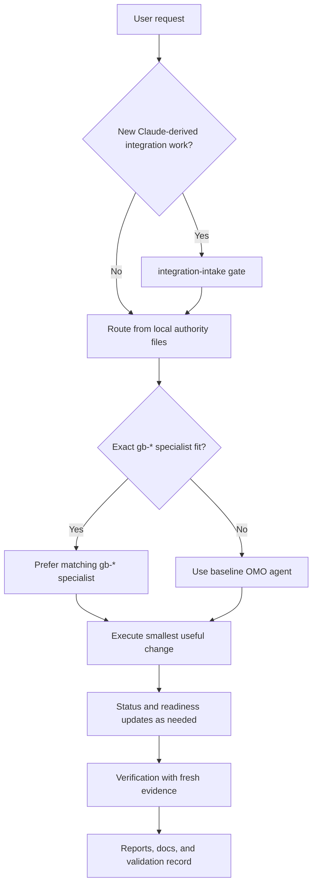
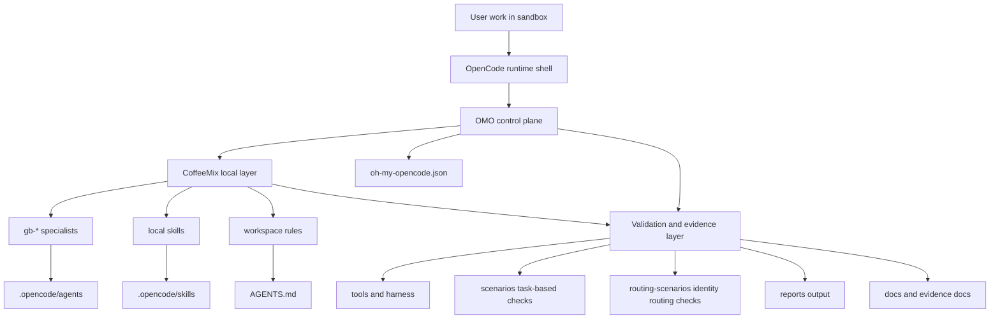
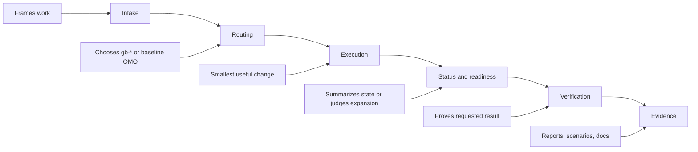

# coffeemix_all Current Workflow and Structure

**Workspace path:** `C:\Work\claude_pickup\opencode_coffeemix_all_sandbox`  
**Purpose:** capture the current sandbox operating model and file structure as they exist now.

## Current-state summary

This sandbox is a local `coffeemix_all` workspace for OMO and CoffeeMix work. It is sandbox-local, documentation-first, and validated through local rules, local skills, task scenarios, routing scenarios, and evidence reports.

The current operating path is:

- OpenCode is the runtime shell.
- OMO is the control plane and routing layer.
- CoffeeMix adds the local `gb-*` specialist layer.
- `integration-intake` is the intake gate for new Claude-derived adoption work.
- intake, readiness, and status each have separate jobs.
- verification alone proves completion.

That separation matters across the current docs and skills:

- intake frames the request, authority files, and scope boundary,
- readiness decides whether broader work should start or expand,
- status summarizes the current state, verified items, open items, or next steps,
- verification collects fresh post-change evidence for the requested deliverable.

## Workflow, current operating path

### What this means now

`AGENTS.md` keeps OMO as the control plane and says to prefer a `gb-*` specialist when the task maps cleanly to one. Broader or mixed work still belongs to baseline OMO agents.

For new Claude-derived adoption work, `integration-intake` comes first. It screens the source behavior, user value, OMO-native target, file surface, non-goals, and why the current surface is not enough. Only after that gate is clear should planning or implementation move ahead.

After execution, the sandbox may produce status or readiness language, but those are not proof. `verification-before-completion` makes the current rule explicit: fresh post-change evidence is the only thing that closes the task.

## Structure and layering

### Current layer responsibilities

| Layer | Current role |
|---|---|
| OpenCode | runtime shell for local execution |
| OMO | control plane, routing, orchestration |
| CoffeeMix | local specialist layer, local skills, workspace behavior |
| Intake gate | screens new Claude-derived adoption work before planning or implementation |
| Status and readiness | summarize current state or decide whether broader work should proceed |
| Verification and evidence | prove behavior through fresh checks, reports, scenarios, and docs |

## Current specialist and skill surface

The current CoffeeMix specialist set named in `AGENTS.md` is:

- `gb-review`
- `gb-debug`
- `gb-ultraplan`
- `gb-commit`
- `gb-worktree`
- `gb-resume`
- `gb-doctor`
- `gb-memory`
- `gb-config`
- `gb-share`
- `gb-statusline`
- `gb-teleport`
- `gb-plugin`
- `gb-compact`

That is the current 14-specialist local surface.

Baseline OMO agents still cover broad work around that layer:

- `sisyphus`
- `oracle`
- `metis`
- `prometheus` / `momus`
- `librarian`
- `explore`

The current local skill surface under `.opencode/skills/` is:

- `ask-user-question`
- `compact-context`
- `enter-plan-mode`
- `integration-intake`
- `systematic-debugging`
- `test-driven-development`
- `tool-search`
- `verification-before-completion`

### Current role split inside the skill surface

| Skill area | Current role |
|---|---|
| `integration-intake` | adoption gate for new Claude-derived patterns |
| `enter-plan-mode` | planning gate before non-trivial implementation work |
| `test-driven-development` | define the red state or acceptance target before editing |
| `systematic-debugging` | root-cause discipline when failure is unclear |
| `verification-before-completion` | proof gate after the final change |
| `ask-user-question` | explicit confirmation before dangerous or irreversible actions |
| `compact-context` | session compaction when context grows large |
| `tool-search` | tool discovery when the correct local tool is unclear |

## Current document and evidence shape

The root `README.md` and `docs/README.md` show two active documentation layers:

- general sandbox docs under `docs/`
- the ordered `docs/superpower/` planning and evidence set

Current status of the ordered set:

- `01` to `15` are design, planning, workflow, and readiness framing
- `16` to `18` record first-wave implementation and authority judgment
- `19` records the brainstorming evaluation and deferral
- the evidence documents record pilot usage, larger task evidence, cleanup/refactoring evidence, brainstorming evaluation, and the consolidated summary

This snapshot doc is not a proposal. It describes the live operating shape that those sources now point to.

### Validation and evidence structure

`AGENTS.md` defines the current validation harness and evidence flow:

- `tools/harness.py` is the shared runner module
- `tools/sandbox_smoke_runner.py` handles smoke checks
- `tools/sandbox_e2e_runner.py` handles full task validation
- `tools/routing_validation_runner.py` handles routing validation
- `reports/` holds generated report output

The two scenario families have different jobs:

- `scenarios/` holds task-based scenarios that check work behavior and output shape
- `routing-scenarios/` holds identity-prompt routing scenarios that check specialist selection across the 14 `gb-*` specialists

### Evidence boundary, current rule

The current boundary wording from the workflow and verification skill should stay explicit:

- intake identifies the request, authority files, and scope boundary
- readiness decides whether work is mature enough to begin or broaden
- status summarizes current state, verified items, open risks, or next steps
- verification proves that the requested outcome was achieved after the final change

Only the last item counts as completion evidence.

For document work, current evidence usually means file existence, headings and sections, link and name consistency, and alignment with the local authority docs. For syntax-bearing files, the evidence layer may also add diagnostics, tests, or builds.

## Maintenance notes

Update this document when any of these change:

- control-plane or routing rules in `AGENTS.md`
- the local specialist surface
- the local skill surface under `.opencode/skills/`
- intake, readiness, status, or verification boundaries
- validation harness layout under `tools/`
- scenario roles under `scenarios/` or `routing-scenarios/`
- the current split between general docs and ordered planning/evidence docs

Keep this file descriptive, current-state, and evidence-based. If planning docs and live authority files differ, treat the live authority files and current local skill docs as stronger sources.
