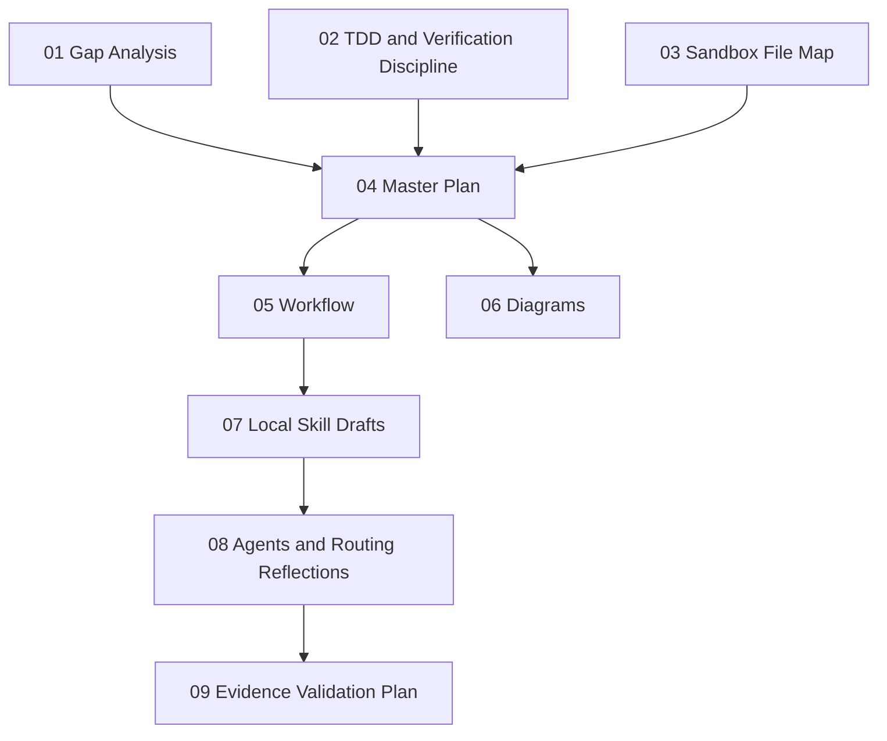
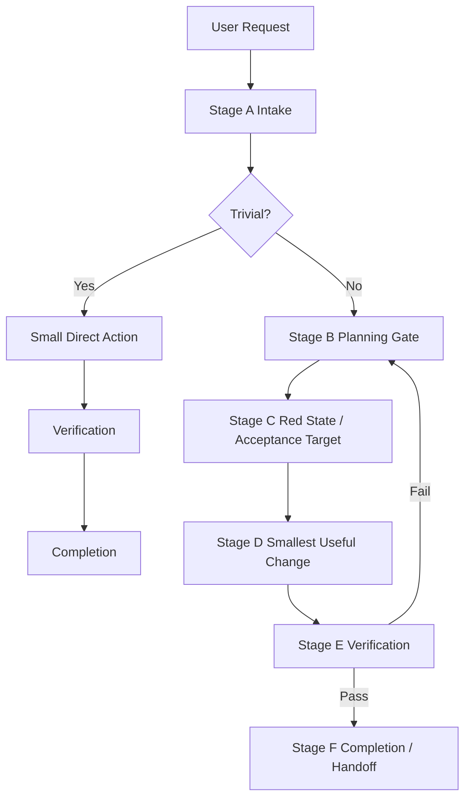
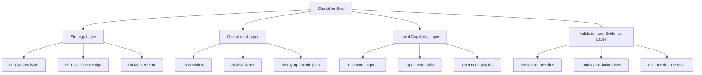
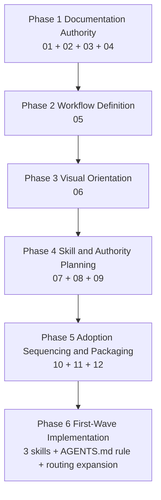

# Superpowers Integration Diagrams for the Local OMO/CoffeeMix Sandbox

**Workspace**: `C:\Work\claude_pickup\opencode_coffeemix_all_sandbox`  
**Purpose**: provide Mermaid-first diagrams that visualize the master plan, workflow, rollout chain, and local file relationships

---

## 1. Diagram conventions

- Diagrams are written in Mermaid first.
- Boxes represent documents, phases, or local file groups.
- Arrows represent dependency, flow, or evidence handoff.
- Dashed or labeled links represent proposal-only relationships.
- The goal is readability and direct renderability, not ASCII preservation.

---

## 2. Diagram A — document relationship map



### Meaning

- `01`, `02`, and `03` are the source analysis set.
- `04` is the synthesis layer.
- `05` and `06` derive the operating and visual layers.
- `07`, `08`, and `09` continue the chain into skill, authority, and evidence planning.

Relevant docs:

- [`01-coffeemix_all-gap-analysis.md`](./01-coffeemix_all-gap-analysis.md)
- [`02-coffeemix_all-tdd-verification-discipline.md`](./02-coffeemix_all-tdd-verification-discipline.md)
- [`03-coffeemix_all-sandbox-file-map.md`](./03-coffeemix_all-sandbox-file-map.md)
- [`04-coffeemix_all-master-plan.md`](./04-coffeemix_all-master-plan.md)
- [`05-coffeemix_all-workflow.md`](./05-coffeemix_all-workflow.md)

---

## 3. Diagram B — workflow lifecycle



### Meaning

- The workflow comes from [`05-coffeemix_all-workflow.md`](./05-coffeemix_all-workflow.md).
- The discipline logic behind the gates comes from [`02-coffeemix_all-tdd-verification-discipline.md`](./02-coffeemix_all-tdd-verification-discipline.md).

---

## 4. Diagram C — local rollout structure



### Meaning

- Strategy docs define intent.
- Operational docs and routing files define execution flow.
- Agents/skills/plugins carry local behavior.
- Evidence docs prove the behavior actually works.

This diagram is derived from:

- [`03-coffeemix_all-sandbox-file-map.md`](./03-coffeemix_all-sandbox-file-map.md)
- [`04-coffeemix_all-master-plan.md`](./04-coffeemix_all-master-plan.md)

---

## 5. Diagram D — capability-to-file crosswalk

```mermaid
graph LR
    P[Planning Gate] --> P1[enter-plan-mode]
    D[Dangerous Action Confirmation] --> D1[ask-user-question]
    B[Root Cause Debugging] --> B1[cc-bughunter]
    B --> B2[systematic-debugging (implemented)]
    R[Review and Signoff] --> R1[cc-review]
    H[Verification and Health Checks] --> H1[cc-doctor]
    H --> H2[verification-before-completion (implemented)]
    T[TDD Discipline] --> T1[test-driven-development (implemented)]
    C[Session Continuity] --> C1[cc-compact]
    C --> C2[cc-resume]
    C --> C3[cc-memory]
    C --> C4[cc-share]
```

### Meaning

- All capability owners now exist locally.
- The three discipline skills (`test-driven-development`, `verification-before-completion`, `systematic-debugging`) are implemented under `.opencode/skills/`.
- The remaining gaps align with the gap analysis rather than replacing the existing specialist layer.

---

## 6. Diagram E — phased rollout view



### Meaning

- The current documentation set now covers phases 1 through 5.
- Phase 6 (first-wave implementation) is now in progress: 3 discipline skills implemented, authority rule added to AGENTS.md.

---

## 7. Maintenance notes

Update these diagrams when:

- a new authority doc is added,
- the workflow stage order changes,
- new local skill files are introduced,
- ownership of a capability changes,
- the rollout leaves documentation-only scope.

---

## 8. Companion documents

- Strategy: [`04-coffeemix_all-master-plan.md`](./04-coffeemix_all-master-plan.md)
- Workflow: [`05-coffeemix_all-workflow.md`](./05-coffeemix_all-workflow.md)
- File map: [`03-coffeemix_all-sandbox-file-map.md`](./03-coffeemix_all-sandbox-file-map.md)
- Gap analysis: [`01-coffeemix_all-gap-analysis.md`](./01-coffeemix_all-gap-analysis.md)
- Discipline model: [`02-coffeemix_all-tdd-verification-discipline.md`](./02-coffeemix_all-tdd-verification-discipline.md)
- Skill planning: [`07-coffeemix_all-local-skill-drafts.md`](./07-coffeemix_all-local-skill-drafts.md)
- Authority reflection: [`08-coffeemix_all-agents-routing-reflections.md`](./08-coffeemix_all-agents-routing-reflections.md)
- Evidence planning: [`09-coffeemix_all-evidence-validation-plan.md`](./09-coffeemix_all-evidence-validation-plan.md)

---

## 9. Bottom line

These diagrams summarize the core idea:

- `01`-`03` explain the problem and local structure,
- `04` unifies them,
- `05` defines the operating sequence,
- `06` makes the whole set quickly understandable.
